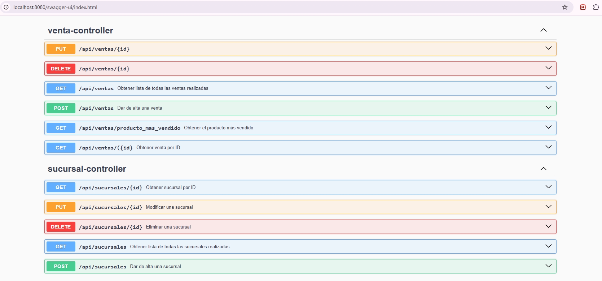
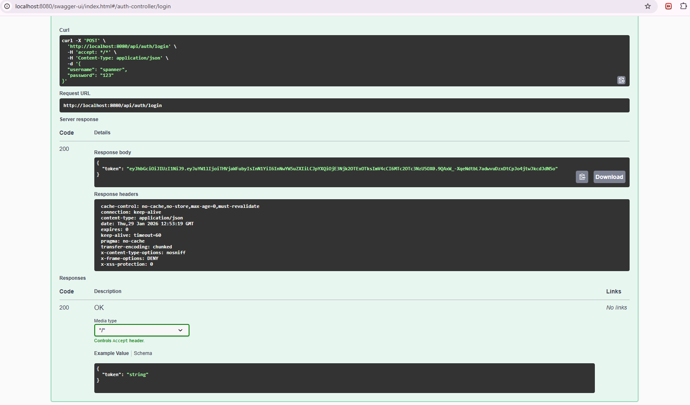
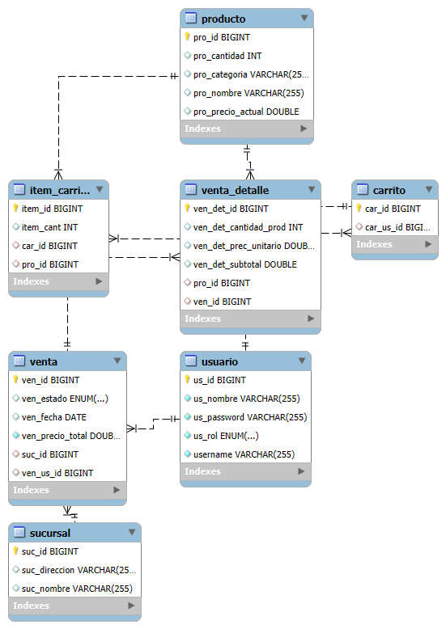

# 🛒 Supermarket REST API


## 📖 Overview

This project is a robust **Backend API** designed to simulate a high-traffic **Supermarket E-commerce platform**. It allows for complete management of the purchasing lifecycle: from product and branch administration to a smart shopping cart system and sales order generation.

The architecture focuses on scalability and security, implementing a **Role-Based Access Control (RBAC)** system with **JWT (JSON Web Token)** authentication and a fully containerized environment using Docker.

## 🚀 Tech Stack

* **Language:** Java 17
* **Framework:** Spring Boot 3
* **Database:** MySQL (Dockerized)
* **Security:** Spring Security 6 + JWT
* **ORM:** Hibernate / JPA
* **Documentation:** OpenAPI (Swagger UI)
* **DevOps:** Docker & Docker Compose
* **Utilities:** Maven, Lombok, ModelMapper

## ✨ Key Features

### 🔐 Security & Authentication
* **JWT Implementation:** Secure Stateless Authentication.
* **RBAC:** Distinct roles for **ADMIN** and **USER**.
* **Route Protection:** Endpoints secured via `Authorization: Bearer Token`.

### 📦 Catalog Management (Admin Role)
* **Branch Management:** CRUD operations for physical store locations.
* **Product Inventory:** Complete management of stock levels and pricing.
* **Performance:** Pagination and sorting implemented for large datasets.

### 🛒 Shopping Experience (User Role)
* **Persistent Smart Cart:** The cart state is saved in the database, not just in the session.
* **Dynamic Calculations:** Automatic computation of totals based on unit/weight.
* **Checkout Process:** Atomic transaction that generates a Sales Order and clears the cart.
* **Purchase History:** Users can view their past orders.

### 📊 Sales Monitoring (Admin Role)
* **Sales Dashboard:** View all transactions with detailed breakdown.
* **Filtering:** Filter sales by date, user, or branch.

## 🛠️ Installation & Setup

### Prerequisites
* [Docker Desktop](https://www.docker.com/products/docker-desktop/) installed and running.
* (Optional) Java 17 and Maven (only if running without Docker).

### Steps to Run
1.  **Clone the repository:**
    ```bash
    git clone [https://github.com/lucianoZG/PruebaTecnicaSupermercado](https://github.com/lucianoZG/PruebaTecnicaSupermercado)
    cd PruebaTecnicaSupermercado
    ```

2.  **Spin up the Infrastructure:**
    Ensure Docker Desktop is running, then execute:
    ```bash
    docker-compose up -d
    ```
    *This will start the MySQL container on port `3307` and the Application on port `8080`.*

3.  **Access the API:**
    The server will be live at: `http://localhost:8080`

## 📑 API Documentation

The project includes interactive documentation generated automatically via Swagger and a ready-to-use Postman Collection.

### 1. Swagger UI

👉 **View Interactive Docs:** http://localhost:8080/swagger-ui/index.html




*Example: JWT Login Response*


### 2. Postman Collection 🚀
To test the API flows immediately, I have included a full collection covering:
* Auth (Register/Login).
* Admin Management (Products/Branches).
* User Purchase Flow (Cart -> Checkout).

📥 **[Download Postman Collection](./assets/supermercado-api.postman_collection.json)**

> **Instructions:** Download the JSON file, open Postman, click **"Import"** (top left), and drag & drop the file.

### Endpoint Examples

| Method | Endpoint | Description | Required Role |
| :--- | :--- | :--- | :--- |
| `POST` | `/api/auth/login` | Get JWT Token | Public |
| `GET` | `/api/productos` | List Catalog (Paginated) | Public |
| `POST` | `/api/productos` | Create New Product | **ADMIN** |
| `GET` | `/api/carrito/mi-carrito` | View My Current Cart | **USER** |
| `POST` | `/api/carrito/{id}/checkout/{branch}` | Finalize Purchase | **USER** |

## 🧪 Roadmap & Quality

* [ ] **Unit Testing:** Implementation of JUnit 5 and Mockito coverage.
* [ ] **Integration Testing:** End-to-end flow validation.
* [ ] **Code Quality:** Integration with SonarQube for static analysis.

## 🗄️ Database Schema (ER Diagram)



## 👤 Author

**Luciano Zanni Giuliano**
* **LinkedIn:** [linkedin.com/in/lucianozannig](https://www.linkedin.com/in/lucianozannig)
* **Email:** lucianozannig@gmail.com
